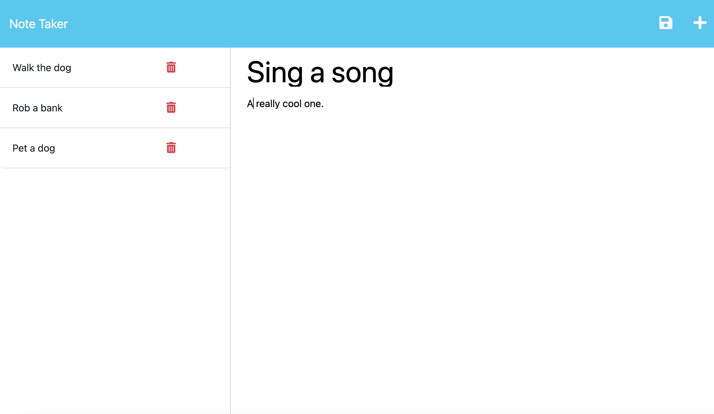

# Note Taking App

This is a simple note-taking application that allows users to create and save notes. When the user clicks on the link to the notes page, they will be presented with a page that has two columns. The left-hand column will display a list of existing notes, and the right-hand column will have empty fields for entering a new note title and text. Creating a new note is easy by clicking on the plus icon to the right side. To save a note you click the save icon to the left of the notes icon.  The left hand column displays the notes made previously. 

This application is deployed on Heroku and can be accessed through the link provided. [click here!](https://a11-notes-app.herokuapp.com/notes)

# Installation 

This application runs on node and express.js. To start the server type
 ``npm i``  in the cli to install these dependencies. Then run ``node server.js`` to start the server. 

# License

[MIT](https://opensource.org/license/mit/)

# Questions?

Contact me at nortongage0@gmail.com 